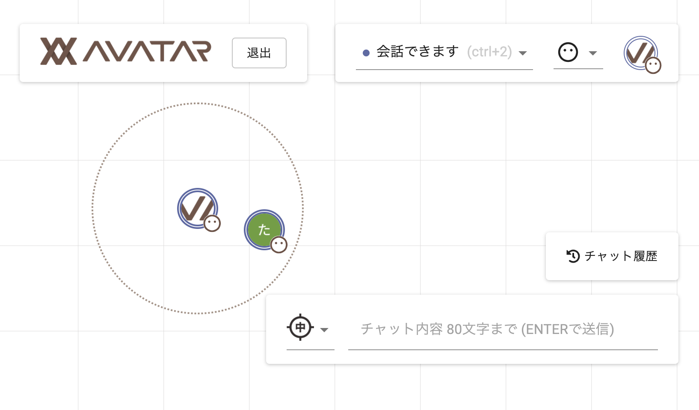
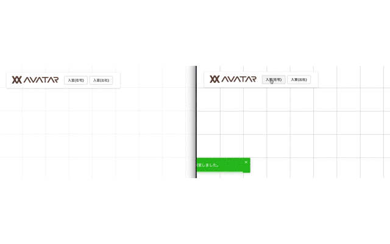
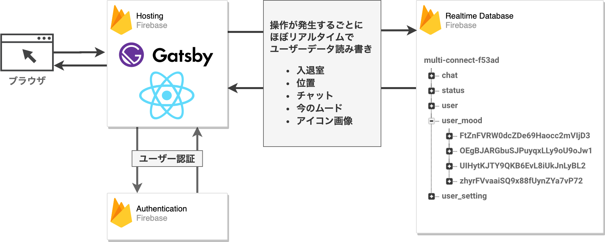
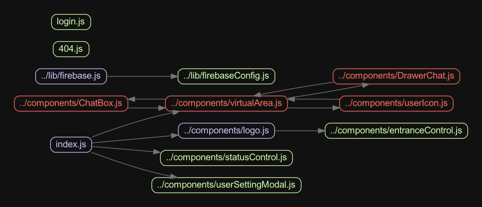

# AVATAR

- 疑似仮想空間でリアルタイムチャットなどができる機能提供
  - バックエンドにFirebase利用
    - 手元に持ってきてinstallationすれば動作チェックできます。
  - ハッカソンで荒く作成したので、細部については保証しません。

+ image
  + 
  + 

# DEMO

- [firebaseホスティング](https://avatar-area.web.app/)

# Features

- アイコンドラッグ
- アイコン画像変更
- ステータス変更
- チャット機能
  - 一定範囲へのチャット送信機能
- 部屋への入退室

# Requirement

+ gatsby
+ npm Package
  + package.json記載
+ firebase
  + realtime database
  + hosting
  + atuhentication

# Installation

1. By Firebase Console
  1. create Firebase Product
  1. activate Firebase Realtime Database
  1. activate Firebase Authentication
    1. activate Google Authentication
  1. activate Firebase Hosting
1. `firebase login`
1. (`firebase init`)
1. (`firebase projects:list`)
1. (`firebase use 【プロジェクトID】`)
 
```shell
yarn
cp src/lib/firebaseConfig.js.sample src/lib/firebaseConfig.js # 自身の設定反映
```

# Usage

## develop

### Start developing

```shell
gatsby develop
```

## deploy

- `gatsby build`
- `firebase deploy`

# Note

+ architecture
  + 
+ component dependents
  + 
    + `madge --exclude (layout|png|jpg|gif|scss) --image madge_graph.png src/pages/`

# Author

* PROGRAM
  * [@TakeshiOnishi](https://github.com/TakeshiOnishi)
  * [@Mocchaso](https://github.com/Mocchaso)
  * [@tokochan1005](https://github.com/tokochan1005)
* DESIGN
  * [@sp-DEGU](https://github.com/sp-DEGU)

# License

+ This software includes the work that is distributed in the Apache License 2.0
